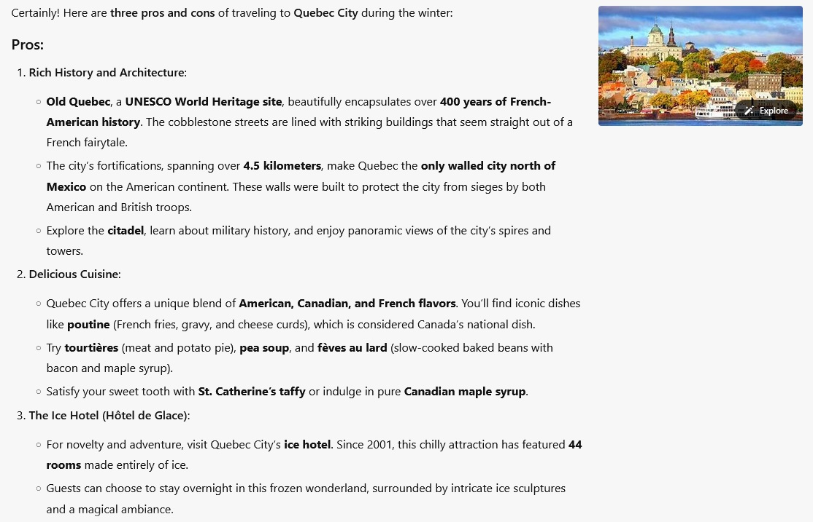
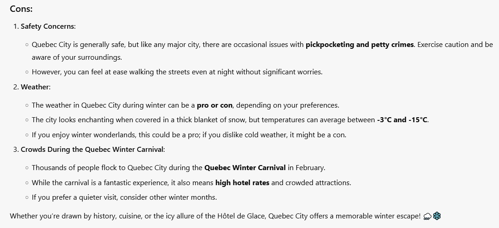
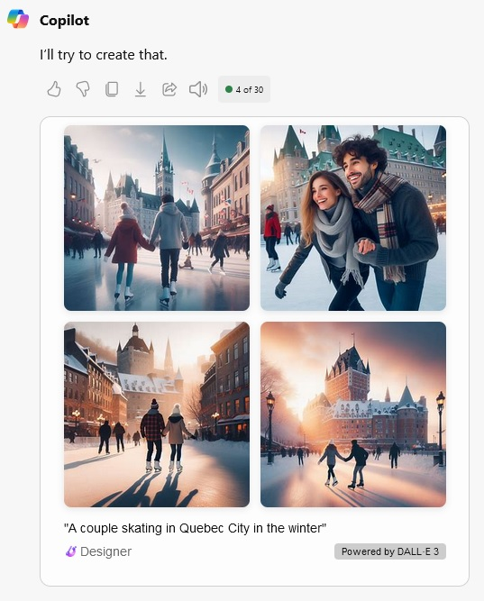

# Desafio Azure OpenAI
Este documento tem por objetivo apresentar o exercício realizado no laboratório do módulo "Explorando os Recursos de IA Generativa com Copilot e OpenAI" do curso "Microsoft Azure AI Fundamentals" da plataforma da [DIO](https://web.dio.me). Neste módulo são apresentados 3 laboratórios, sendo o primeiro o [Explore generative AI with Microsoft Copilot](https://aka.ms/ai900-bing-copilot), o segundo o [Explore Azure OpenAI](https://aka.ms/ai900-azure-openai) e o terceiro o [Explore content filters in Azure OpenAI](https://aka.ms/ai900-content-filters). Apenas o primeiro laboratório será descrito neste documento, pois os outros dois necessitam de um email corporativo, e não pessoal, para acessar a plataforma do [Azure OpenAI Studio](https://oai.azure.com/portal), o que não se aplica ao meu caso. Utilizou-se então a documentação acima indicada do primeiro laboratório como inspiração para a utilização do [Microsoft Copilot](https://copilot.microsoft.com).

💡 Como minhas configurações do Microsoft são em inglês, tanto os comandos quanto os resultados serão apresentados neste idioma.

## Utilizando o Microsoft Copilot
Para a utilização completa das ferramentas do Microsoft Copilot é necessário realizar o "Sign In" na plataforma, pois, por exemplo, neste exercício, só é possível fazer a segunda parte possuindo uma conta Microsoft. Esse laboratório consiste então em duas partes. A primeira trata-se de utilizar o chat para gerar uma resposta escrita a uma pergunta e a segunda trata-se da geração de imagens de acordo com os itens escolhidos.

### Geração de Resposta Escrita
Para utilizar essa ferramenta, inspirei-me na proposta da documentação adicionando a cidade onde moro. A pergunta realizada à inteligência artifical foi "What are 3 pros and cons of traveling in the winter to Quebec City?". Estes foram os resultados gerados:

### Geração de Imagens
Ao contrário da documentação que solicitou uma imagem mais abstrata, eu fiz o pedido de imagens ligado ao tema utilizado no tópico anterior. A minha solicitação foi "Create an image of a couple skating in Quebec City in the winter". E os resultados gerados foram:

## Analisando os Resultados
Como moradora da cidade utilizada para parâmetro de busca, considero a resposta gerada pela inteligência artificial interessante pois destaca os aspectos históricos e culturais da cidade e inclui o Carnaval de Quebec como atração de inverno em Fevereiro e o Hotel de Gelo como atração. Mas na parte dos aspectos negativos, a margem de temperaturas médias está um pouco alta e a parte de segurança está equivocada, pois Quebec não é uma cidade tão grande com os problemas apresentados, isso é encontrado de fato em Montreal, metrópole na mesma província.
Quanto à geração de imagens, destaco que todas elas mostram o Château Frontenac como plano de fundo, pois se trata do principal cartão postal da cidade. Apesar de saber que não existem pistas de patinação que contemplem essas vistas do monumento em questão, as imagens geradas atenderam os requisitos solicitados.

## 💻Programas Utilizados
  
